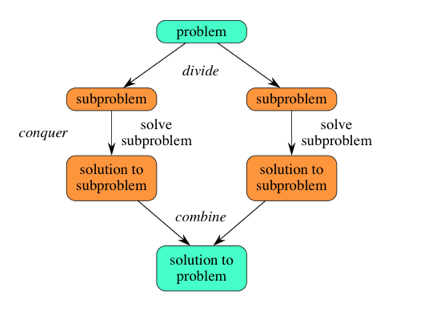

# Divide and Conquer

分治算法

分而治之：把一个复杂的问题分成两个或更多的相同或相似的子问题，再把子问题分成更小的子问题……直到最后子问题可以简单的直接求解，原问题的解即子问题的解的合并。

> A divide and conquer algorithm works by recursively breaking down a problem into two or more sub-problems of the same (or related) type, until these become simple enough to be solved directly.
The solutions to the sub-problems are then combined to give a solution to the original problem.

## Step
- 分解：将原问题分解为若干个规模较小，相互独立，与原问题形式相同的子问题
- 解决：若子问题规模较小而容易解决则直接求解，否则递归地解各个子问题
- 合并：将各个子问题的解合并为原问题的解

## Example
**找出伪币**: 一个袋子里面装了n个银币，n-1个是真的，1个是假的，假的比真的重量轻，找出那一枚假的银币

-> 每次分成3份，递归求解

**分金块**: 一个袋子里面有n个不同重量的金块，找出最重和最轻的金块

-> 分成k份，找出每份的Max和Min，再把这k个Max和Min合并在一起，递归求解

**常用例子**
- 二分搜索
- Quick Sort
- Merge Sort
- 大整数乘法

## Links
[分治1](http://blog.csdn.net/com_stu_zhang/article/details/7233761)
[分治2](http://blog.163.com/hadyk1111@126/blog/static/29599406200752345233993/)
[大整数乘法](http://blog.csdn.net/tjsinor2008/article/details/5625849)
